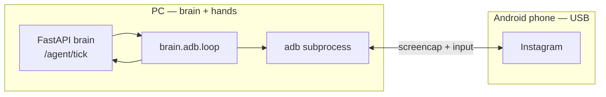

# Friday UGC — ADB migration

> Replace the Kotlin/Android accessibility agent with a Python ADB executor on the PC.  
> **Status:** implemented · **Branch:** `ADB-USB`

## Summary

Friday stays **remote brain / local hands**, but “hands” move from an on-phone APK to **ADB subprocess calls** on the same machine that runs the brain. The phone is a USB-tethered display; the PC owns the agent loop, scheduling, and motor layer.

```
Before:
  Phone (Kotlin + Accessibility) ──Wi-Fi──▶ PC/AWS (brain)

After:
  Phone (screen only) ◀──USB ADB── PC (brain + adb executor loop)
```

The brain (`brain/`) is unchanged. `android/` is removed when the ADB path meets acceptance criteria below.

## Why

| Problem with Android agent | ADB approach |
|---|---|
| APK rebuild cycle (Gradle/Kotlin) | Edit Python, rerun |
| Accessibility permission UX | USB debugging only |
| Sparse IG accessibility tree | Vision-first from day one |
| Wi-Fi hop phone → PC brain | Same host; optional localhost HTTP |
| Two codebases for one loop | One Python stack |

**Explicit non-goals for v1:**

- No TTS / voice on device or PC — ignore the `say` field in tick responses
- No reading or porting Kotlin — `android/` is deleted, not used as reference
- No standalone phone operation — USB must stay connected

## What we keep

| Path | Role |
|------|------|
| [`brain/`](../brain/) | FastAPI, `/agent/tick`, grounding, perception, routines, learning, eval |
| [`shared/action_protocol.md`](../shared/action_protocol.md) | Action contract (updated: executor = PC ADB, not phone) |
| [`infra/`](../infra/) | AWS GPU + vLLM deploy |
| [`docs/SAFETY_AND_BANS.md`](SAFETY_AND_BANS.md) | Account safety rules (unchanged) |

**Brain files that define executor behavior** (read these; ignore `android/`):

- `brain/app/agent/actions.py` — `TickRequest`, `TickResponse`, `ObserveBundle`, `TickLastResult`
- `brain/app/agent/tick.py` — verify, plan, ground (brain-owned loop)
- `brain/app/agent/grounding.py` — anchor semantics (`comment_heart`, `comments_icon`, `nav_reels`)
- `brain/app/agent/routines.py` — comment-likes phases
- `brain/app/agent/verifier.py` — what before/after observe must contain
- `brain/app/agent/perception.py` — screen classification

## What we remove

- `android/` — entire Kotlin accessibility agent
- `docs/ANDROID_BUILD.md`
- Android APK GitHub Actions workflow
- README / architecture references to APK, Accessibility API, on-device TTS

## New layout

```
brain/adb/
  __init__.py
  adb.py           # subprocess: screencap, tap, swipe, keyevent, dumpsys, wm size
  device.py        # serial → device_id, keep-awake, wake screen
  screenshot.py    # capture PNG, resize max 768px, base64
  observe.py       # build ObserveBundle (vision-first; elements=[] in v1)
  gestures.py      # jitter taps, reels swipe, comments-sheet scroll
  safety_zones.py  # minimal tap blocks (e.g. story tray y < 28%)
  validate.py      # coordinate sanity before tap
  executor.py      # dispatch actions from action_protocol.md via adb
  client.py        # httpx → brain (tick, learning/trajectory, learning/memory)
  learning.py      # trajectory + device memory sync
  loop.py          # observe → tick → execute → TickLastResult
  run.py           # CLI entrypoint
  README.md        # setup + troubleshooting
```

## Architecture



### Request lifecycle (unchanged contract)

1. Executor captures screenshot (+ optional foreground app from `dumpsys window`).
2. `POST /agent/tick` with `ObserveBundle` and optional `TickLastResult`.
3. Brain verifies last step, plans next action, grounds vision anchors if needed.
4. Executor runs one action via ADB (`tap`, `swipe`, `keyevent`, etc.).
5. Executor captures `after_observe`, reports to `POST /learning/trajectory`.
6. Repeat until `done`, `fail`, or step limit.

Verification lives in the brain (`tick.py` + `verifier.py`), not on the executor.

## ADB motor mapping

| action | ADB |
|--------|-----|
| `tap` | `adb shell input tap X Y` (+ small jitter) |
| `scroll` / `swipe` | `adb shell input swipe x1 y1 x2 y2 duration_ms` |
| `press` | `keyevent` 4=back, 3=home, 66=enter |
| `open_app` | `adb shell monkey -p com.instagram.android 1` |
| `open_reels` | `adb shell am start -a android.intent.action.VIEW -d instagram://reels` |
| `type` | `cmd clipboard set` + `keyevent 279` (paste) — never `input text` |
| `wait` | `time.sleep(ms)` in Python |

### Session prep (run once per session)

```bash
adb shell settings put system screen_off_timeout 2147483647 && adb shell svc power stayon usb && adb shell input keyevent KEYCODE_WAKEUP
```

### Gesture defaults (v1 — tune from live runs)

| Gesture | Approx coords |
|---------|----------------|
| Reels next | x ≈ 85% width, swipe y 52% → 22% |
| Comments sheet scroll | x ≈ 50% width, swipe y 78% → 58% |
| Story tray block | reject taps with y < 28% height |

Grounding coords for anchors (`comment_heart`, `comments_icon`, …) come from the brain — see `brain/app/agent/grounding.py`.

### Settle delays (ms)

| Action | Delay |
|--------|------:|
| `open_app` | 4500 |
| `navigate`, `open_reels` | 2800 |
| `swipe`, `scroll` | 900 |
| `press` | 700 |
| `like_comment`, `tap` | 650 |
| default | 500 |

## CLI

```bash
python -m brain.adb.run --brain-url http://127.0.0.1:8080 --token "$FRIDAY_API_TOKEN" --goal "Run comment likes on Reels" --mode read_only --max-steps 40 --serial <adb_serial>
```

| Flag | Purpose |
|------|---------|
| `--mode read_only` | Blocks like/comment/post/dm/follow/type |
| `--autonomous` | Skip terminal approval prompts |
| `--routine comment_likes` | Calls `POST /ugc/routine` first for goal + budgets |
| `--serial` | When multiple devices connected |

### Full stack (bash)

```bash
cd brain && source .venv/bin/activate && FRIDAY_LLM_PROVIDER=ollama FRIDAY_GROUNDING_ENABLED=true uvicorn app.main:app --host 0.0.0.0 --port 8080 & python -m brain.adb.run --goal "Open Instagram and scroll Reels" --mode read_only
```

## Loop behavior

Ported from the **brain tick contract only** (not Kotlin):

- Hydrate device memory: `GET /learning/memory/{device_id}`
- `read_only` blocks: `post`, `comment`, `dm`, `follow`, `unfollow`, `like`, `like_story`, `like_comment`, `save`, `type`
- `approval_required` → terminal prompt `Approve {action}? [y/N]` unless `--autonomous`
- `needs_screenshot` → recapture with `screenshot_b64` and retry tick
- Circuit breaker: stop after 8 consecutive failures
- Recovery: at 5 failures, `back` + wait, reset counter
- Sync memory on session end: `POST /learning/memory`
- **`say` field:** log only; no TTS

## Observe bundle (v1)

Vision-first. Minimal tree.

```json
{
  "screen": {
    "app": "com.instagram.android",
    "activity": "MainActivity",
    "elements": [],
    "screenshot_b64": "<png b64 when on IG or brain requests vision>"
  },
  "screen_width": 1080,
  "screen_height": 2400,
  "som_marks": []
}
```

Optional later: sparse `uiautomator dump` elements. Not required for comment-likes / Reels with grounding enabled.

## Tests

- `brain/tests/test_adb_executor.py` — mocked subprocess, safety zones, action dispatch
- `brain/tests/test_adb_loop.py` — mocked brain client, read_only, circuit breaker
- All existing brain pytest must still pass (`FRIDAY_LLM_PROVIDER=mock`)

```bash
cd brain && FRIDAY_LLM_PROVIDER=mock FRIDAY_API_TOKEN=test-token pytest -q
```

## Docs to update (after implementation)

- [ ] `README.md` — ADB quick start; remove APK/Android/TTS
- [ ] `docs/ARCHITECTURE.md` — new diagram
- [ ] `docs/SETUP_GUIDE.md` — USB debugging, `adb devices`, run command
- [ ] `shared/action_protocol.md` — executor on PC via ADB
- [ ] Delete `docs/ANDROID_BUILD.md`

## Acceptance criteria

1. `adb devices` lists the phone; executor completes ≥5 tick steps for goal `"Open Instagram"`.
2. Comment-likes routine works with `FRIDAY_GROUNDING_ENABLED=true`.
3. `POST /learning/trajectory` receives steps during a live run.
4. Read-only mode blocks engagement actions.
5. Terminal approval works for `comment` / `post` without `--autonomous`.
6. All brain pytest pass.
7. `android/` deleted; no Kotlin in repo.
8. No TTS in executor or updated docs.

## Migration steps

1. Branch from current HEAD (not old `main`): `git checkout -b feat/adb-only`
2. Implement `brain/adb/` bottom-up: `adb.py` → `observe` → `executor` → `loop` → `run.py`
3. Run live smoke on USB device with brain on localhost
4. Add tests; fix regressions
5. Update docs listed above
6. Delete `android/` and Android CI
7. Merge when acceptance criteria pass

## Prerequisites

- Android phone with **USB debugging** enabled
- [Android platform-tools](https://developer.android.com/tools/releases/platform-tools) (`adb` on PATH)
- Phone unlocked or “stay awake while charging” for long sessions
- Brain `.env` with `FRIDAY_API_TOKEN`; grounding enabled for Reels flows

```bash
adb devices
```

Expected: one device `device` (not `unauthorized`).

## Risks

| Risk | Mitigation |
|------|------------|
| ADB disconnect | Retry wrapper; fail loud after 3 attempts |
| Clipboard typing fails on OEM | Test on OnePlus; fallback key-by-key for ASCII |
| IG secure screen blocks screencap | Manual unlock; avoid login/checkpoint screens |
| USB debugging flag | Personal account only; same ban risk as accessibility |
| PC must stay on | Acceptable for desk setup; use AWS brain + local executor if split later |

## Out of scope (later)

- Wireless ADB
- `uiautomator` element tree in observe
- PC-side task scheduler / cron operator
- Split brain on AWS + executor on home PC (works today via `--brain-url`)

---

*Decision record: 2026-07-15 — drop Kotlin agent; brain-only reference; USB-tethered ADB executor on PC.*
