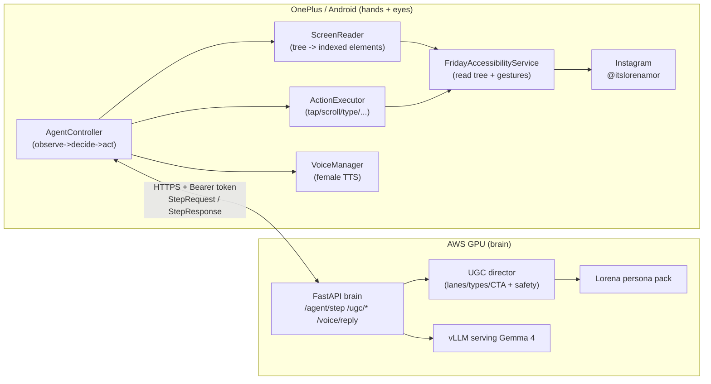

# Friday UGC — Architecture

## One-paragraph summary

Friday is a **remote-brain / local-hands** agent. A **Gemma 4** model runs on an **AWS GPU** box
(served by vLLM, OpenAI-compatible) behind a small **FastAPI brain**. Your **Android phone** runs a
Kotlin agent that uses the **Accessibility API** to read the Instagram UI and perform taps, scrolls,
and typing. The phone sends screen state to the brain each step and executes the single action the
brain returns. Friday also has a **female voice** (on-device TTS) and can run on voice command or
autonomously on a schedule.

## Diagram

## Request lifecycle (agent step)

1. `AgentController` asks `FridayAccessibilityService` for the current screen.
2. `ScreenReader` flattens the accessibility tree into a compact indexed element list.
3. `ScreenClassifier` produces structured `ScreenState` (screen type, confidence, vision flag).
4. The phone POSTs `StepRequest` to `/agent/step` with goal, screen, dwell time, and history.
5. The brain builds a prompt (persona + screen state + **intent vocabulary**) and asks Gemma for
   **one action or intent** as JSON.
6. If the response is an `intent`, `IntentResolver` translates it to motor actions using fresh UI + device memory.
7. `GestureHelper` executes human-like gestures; `OutcomeVerifier` checks the UI actually changed.
8. Verified outcomes sync to `DeviceMemoryStore` and the brain learning API.

See `docs/COGNITIVE_AGENT.md` for the full two-level cognition model.

## Content lifecycle (creation, not UI driving)

`/ugc/plan`, `/ugc/caption`, `/ugc/prompt` produce a reel plan, an Instagram caption, or a
Seedance/Marketing-Studio generation prompt — all in Lorena's voice, run through the safety
word-swap layer. These are the "think like a UGC creator at human speed" endpoints.

## Why this split

- The phone can't run a big model well; AWS can. Gemma 4 12B on a g5 gives strong reasoning.
- The brain is model-agnostic (`LLMClient`): swap Gemma for another endpoint without touching
  persona/director/agent code.
- The account stays safe because approval + pacing live on both sides.

## Component map

| Concern | Lives in |
|--------|----------|
| Persona / voice / rules | `brain/app/persona/` |
| UGC creation | `brain/app/ugc/` |
| Phone-driving decisions | `brain/app/agent/` |
| Model access | `brain/app/llm/` |
| Screen read + gestures | `android/.../ScreenReader.kt`, `ActionExecutor.kt` |
| Loop + pacing + approval | `android/.../AgentController.kt` |
| Deploy | `infra/` |
