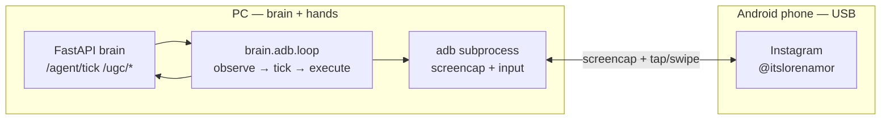

# Friday UGC — Architecture

## One-paragraph summary

Friday is a **remote-brain / local-hands** agent. A **Gemma** model runs on an **AWS GPU** box
(served by vLLM, OpenAI-compatible) behind a small **FastAPI brain**. Your **Android phone** is
USB-tethered to the PC; a Python **ADB executor** captures screenshots and performs taps, scrolls,
and typing via `adb shell input`. The executor sends screen state to the brain each tick and runs
the single action the brain returns. Friday runs on voice command or autonomously on a schedule
(brain-side); the `say` field in tick responses is logged only (no TTS in the ADB path).

## Diagram

## Request lifecycle (tick loop)

1. ADB executor captures screenshot (+ foreground app from `dumpsys window`).
2. Executor POSTs `TickRequest` to `/agent/tick` with `ObserveBundle` and optional `TickLastResult`.
3. Brain verifies the last step, updates `session_context`, plans the next move, inline-grounds vision targets.
4. Executor runs one action via ADB (`tap`, `swipe`, `keyevent`, etc.).
5. Executor captures `after_observe`, reports to `POST /learning/trajectory`.
6. Repeat until `done`, `fail`, or step limit.

Verification lives in the brain (`tick.py` + `verifier.py`), not on the executor.

See `docs/COGNITIVE_AGENT.md` for the full two-level cognition model.

## Content lifecycle (creation, not UI driving)

`/ugc/plan`, `/ugc/caption`, `/ugc/prompt` produce a reel plan, an Instagram caption, or a
Seedance/Marketing-Studio generation prompt — all in Lorena's voice, run through the safety
word-swap layer. These are the "think like a UGC creator at human speed" endpoints.

## Why this split

- The phone can't run a big model well; AWS (or a local GPU) can.
- The brain is model-agnostic (`LLMClient`): swap Gemma for another endpoint without touching
  persona/director/agent code.
- ADB removes the APK rebuild cycle and sparse accessibility trees — vision-first from day one.
- The account stays safe because approval + pacing live on both sides.

## Component map

| Concern | Lives in |
|--------|----------|
| Persona / rules | `brain/app/persona/` |
| UGC creation | `brain/app/ugc/` |
| Phone-driving decisions | `brain/app/agent/` |
| Model access | `brain/app/llm/` |
| ADB motor + loop | `brain/adb/` |
| Deploy | `infra/` |
