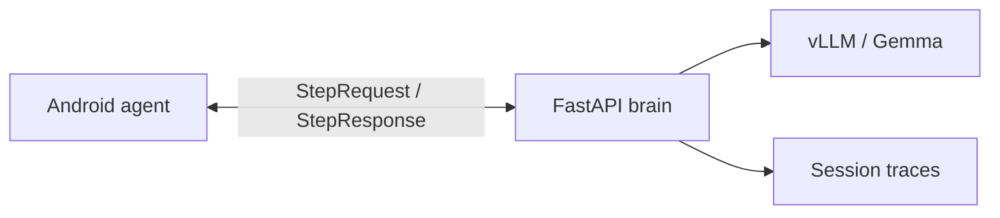

# Friday UGC — Case Study

> End-to-end autonomous AI operator: remote brain, local Android executor, production-shaped delivery.

## Problem

Run a UGC Instagram persona (`@itslorenamor`) with an AI that can:

- plan content in a consistent voice
- drive the phone UI like an operator (scroll, navigate, engage)
- stay within safety and engagement budgets
- require human approval before irreversible actions

The hard part is not calling an LLM once. It is **reliable multi-step control** with guardrails, cloud deployment, and evidence you can debug when it fails.

## Solution architecture

**Remote brain / local hands** split:

| Layer | Role | Tech |
|-------|------|------|
| Brain | Reasoning, persona, safety, content | FastAPI, Gemma via vLLM on AWS GPU |
| Hands | Screen read + gestures | Kotlin, Android Accessibility API |
| Contract | One action per step as JSON | `shared/action_protocol.md` |



Each agent step:

1. Phone captures accessibility tree → `StepRequest`
2. Brain prompts model for **one** JSON action
3. Server-side guards enforce read-only mode, budgets, approval gates
4. Phone executes via `ActionExecutor` and loops

## Key engineering decisions

### 1. Plain Python agent loop (not framework-first)

The default path is a direct LLM loop with Pydantic schemas and server-side guards. Optional Microsoft Agent Framework routing exists, but the production default is **legacy** — fewer moving parts, easier to test.

### 2. Safety on the server, not only in prompts

High-risk actions (`post`, `comment`, `dm`, `follow`) are approval-gated in `apply_guards`. Read-only mode blocks engagement mutations even if the model suggests them. Session budgets cap likes, reels, DMs, etc.

### 3. Mock LLM for CI

`FRIDAY_LLM_PROVIDER=mock` runs the full pipeline without GPU. Smoke tests and agent eval fixtures run in GitHub Actions on every brain change.

### 4. Observability built in

Every `/agent/step` writes a trace to `brain/data/runs/{session_id}.json`:

- action chosen
- latency per step
- guard interventions
- session completion status

APIs:

- `GET /runs` — recent sessions
- `GET /runs/{session_id}` — full trace
- `GET /runs/metrics` — aggregate completion rate, latency, guard rate

### 5. Agent eval harness

Frozen scenarios in `brain/tests/fixtures/agent_scenarios/` validate:

- opens Instagram when not foreground
- scrolls when feed is open
- read-only blocks likes
- budget enforcement
- approval rules

Run:

```bash
cd brain && FRIDAY_LLM_PROVIDER=mock FRIDAY_API_TOKEN=test-token pytest tests/test_agent_eval.py tests/test_retrieval.py -q
```

### 6. RAG for gallery curation and caption style

Semantic retrieval over vision-enriched gallery assets and posted captions:

- **Gallery** — `/ugc/curate` retrieves top-K assets before the director LLM call; scores in `rag_hits` + `rag_scores:` warnings
- **Captions** — `/ugc/caption` retrieves similar posted captions as few-shot style references
- **Index** — SQLite at `brain/data/gallery/rag_index.db`; incremental hash-based sync
- **Embeddings** — `mock` (CI), `ollama` (AWS GPU), or `azure` (managed)

APIs:

- `POST /gallery/index` — rebuild gallery embedding index
- `POST /gallery/index-captions` — rebuild caption index from posted queue
- `GET /health` — `rag_gallery_indexed`, `rag_caption_indexed`, `embedding_provider`

Production on AWS (docker-compose defaults):

```bash
EMBEDDING_PROVIDER=ollama EMBEDDING_BASE_URL=http://host.docker.internal:11434/v1 docker compose up -d
```

Azure:

```bash
FRIDAY_EMBEDDING_PROVIDER=azure FRIDAY_EMBEDDING_AZURE_ENDPOINT=... FRIDAY_EMBEDDING_AZURE_API_KEY=...
```

## Production metrics (template — fill from live runs)

After 10+ real sessions on a throwaway account, record:

| Metric | Target to document |
|--------|-------------------|
| Task completion rate | % sessions ending in `done` |
| P50 latency / step | ms from `GET /runs/metrics` |
| Guard intervention rate | % steps with `guard_triggered` |
| Cost / session | GPU $/hr ÷ sessions/hr |
| Eval pass rate (mock) | 100% on fixture suite |

Example placeholder (replace with your numbers):

- **4 steps**, **~950 ms P50 latency**, **0 guard hits** on a read-only scroll demo
- **6/6 eval scenarios pass** on mock provider
- **g5.xlarge**: estimate ~€0.15–0.25/session for short scroll tasks

## Failure modes handled

| Failure | Mitigation |
|---------|------------|
| Model returns bad JSON | `parse_step_json` extracts JSON substring; falls back to `wait` |
| Model suggests banned action in read-only | Server replaces with safe `swipe` |
| Engagement budget exceeded | Server redirects to next phase |
| LLM timeout / flake | Retries with backoff (`FRIDAY_LLM_MAX_RETRIES`) |
| IG UI changes | Indexed accessibility tree + optional screenshot flag |
| Account ban risk | Approval gates + human-like pacing on device |

## What this proves (vs enterprise AI CV)

| Enterprise asks for | FridayUGC demonstrates |
|--------------------|-------------------------|
| End-to-end AI delivery | Brain + Android + deploy |
| System design | Remote brain / local hands |
| Cloud | AWS GPU, CloudFormation, Docker |
| Agents | Observe-decide-act loop with state |
| LLMOps (credible slice) | Eval harness, session traces, health checks, **RAG retrieval scores** |
| RAG | Gallery curation (`/ugc/curate`) + caption style (`/ugc/caption`) via SQLite vector index |
| Responsible AI | Approval gates, budgets, safety sanitization |

## What is still manual (honest scope)

- No multi-tenant platform or model registry
- No Spark/data-lake integration
- Run metrics need real session data from your phone tests
- Demo video not included in repo — record one 2–3 min flow for portfolio

## Next steps to maximize hiring signal

1. Run 10 sessions on throwaway IG → export `/runs/metrics`
2. Record demo video: goal → scroll → done
3. Paste real metrics into the table above
4. Export this doc + `ARCHITECTURE.md` to PDF for applications

## Commands

```bash
cd brain && python -m venv .venv && . .venv/bin/activate && pip install -r requirements.txt && FRIDAY_LLM_PROVIDER=mock FRIDAY_API_TOKEN=test-token pytest -q
```

```bash
curl -s localhost:8080/health | jq .
curl -s -H "Authorization: Bearer $FRIDAY_API_TOKEN" localhost:8080/runs/metrics | jq .
```
