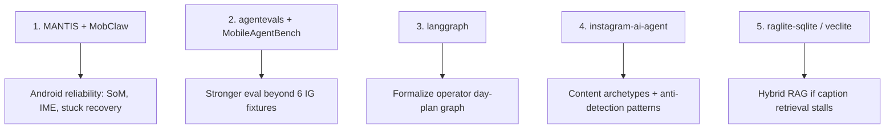

# GitHub Repos to Improve Friday UGC Faster

Curated open-source repositories worth studying for **Friday UGC**, grouped by what moves the project fastest given the current stack: remote FastAPI brain + Android Accessibility agent + RAG + eval harness.

---

## Tier 1 — Highest leverage (closest to your architecture)

These match the **observe → decide → act** loop on real Android UI, not browser/API automation.

| Repo | Why it helps Friday | What to steal |
|------|---------------------|---------------|
| [**sajjad-vahdatzadeh/mantis**](https://github.com/sajjad-vahdatzadeh/mantis) | Native Kotlin agent with Accessibility + live step UI — almost your twin | Set-of-Marks overlays, custom IME typing, stuck-screen detection, multi-provider LLM routing |
| [**wamynobe/mobclaw**](https://github.com/wamynobe/mobclaw) | 100% Kotlin, semantic screen → LLM → `dispatchGesture` | Clean tool registry pattern (`ScreenReadTool`, `ClickTool`), node-ID → coordinate resolution |
| [**dascard/Open-AutoGLM-App**](https://github.com/dascard/Open-AutoGLM-App) | Android-native AutoGLM with SoM + hybrid accessibility/Shizuku | SoM screenshot grounding when indexed elements fail; structured action loop |
| [**RobinHeZtto/Open-AutoGLM-Android**](https://github.com/RobinHeZtto/Open-AutoGLM-Android) | Same stack as you: Kotlin + OkHttp + Coroutines + remote vLLM | Vision-first fallback when tree parsing is weak (Instagram reels/overlays) |
| [**Akeem1955/Genie**](https://github.com/Akeem1955/Genie) | On-device Gemma agent with 53 tools + memory | Novel-plan memory, event bus for step tracing, human-like gesture pacing |
| [**SunZhi-Will/OpenRing**](https://github.com/SunZhi-Will/OpenRing) | Phone-first RPA + ReAct + WorkManager scheduler | Autonomous scheduler (`AgentRunner.kt`) could borrow its script/schedule model |

**Best fit for Friday today:** **MANTIS** + **MobClaw** for Android executor improvements; **Open-AutoGLM-App** if Instagram screens break your indexed-element approach often.

---

## Tier 2 — Eval, benchmarks, and LLMOps

Friday already has 64 brain tests — these repos level up eval coverage and observability.

| Repo | Why it helps | What to steal |
|------|--------------|---------------|
| [**MobileAgentBench/mobile-agent-bench**](https://github.com/MobileAgentBench/mobile-agent-bench) | 100 real-device tasks with flexible success conditions | Extend beyond the 6 frozen IG scenarios; auto-detect task completion via UI state |
| [**TencentQQGYLab/AppAgent**](https://github.com/TencentQQGYLab/AppAgent) | CHI paper + open eval benchmark (50 tasks / 10 apps) | Benchmark format + "learning phase" docs from exploration/demos (like `DeviceMemoryStore`) |
| [**langchain-ai/agentevals**](https://github.com/langchain-ai/agentevals) | Trajectory matching + LLM-as-judge for agent steps | Upgrade `test_agent_eval.py` from exact-action asserts → trajectory/subset matching |
| [**langchain-ai/langgraph**](https://github.com/langchain-ai/langgraph) | Docs already flag this as the next orchestration step | Formalize `operator/planner.py` phases as a graph with interrupt nodes for approval |
| [**dotdigitize/latenttracerag**](https://github.com/dotdigitize/latenttracerag) | Local eval framework with latency + failure-case telemetry | Enrich `GET /runs/metrics` with stage-wise latency and failure categories |
| [**reacher-z/awesome-agent-benchmarks**](https://github.com/reacher-z/awesome-agent-benchmarks) | Curated list of agent benchmarks | Pick 2–3 mobile benchmarks to regression-test against |

**Best fit:** **agentevals** + **MobileAgentBench** — the eval mindset exists; these add industry-standard trajectory eval and real-device coverage.

---

## Tier 3 — Brain / orchestration (partially implemented)

| Repo | Why it helps | Notes |
|------|--------------|-------|
| [**microsoft/agent-framework**](https://github.com/microsoft/agent-framework) | MAF already supported via `maf_loop.py` | Mine `python/samples/05-end-to-end` for eval + HITL patterns |
| [**microsoft/agent-framework-samples**](https://github.com/microsoft/agent-framework-samples) | Beginner → multi-agent workflows | RAG + planning samples map to `/ugc/curate` and day-plan |
| [**zai-org/Open-AutoGLM**](https://github.com/zai-org/Open-AutoGLM) | 25k⭐ phone agent; vLLM + ADB | Compare action JSON schema vs `shared/action_protocol.md`; optional second model for hard screens |

---

## Tier 4 — UGC content layer (Instagram *content*, not UI driving)

These won't replace the Accessibility agent, but they accelerate **caption/plan/calendar** work.

| Repo | Why it helps | Caveat |
|------|--------------|--------|
| [**alsk1992/instagram-ai-agent**](https://github.com/alsk1992/instagram-ai-agent) | Full autonomous IG operator: content types, anti-detection, 671 tests, niche RAG | Uses API/VPS path, not Accessibility — borrow **content archetypes**, **pacing**, **anti-detection** ideas |
| [**anthonyonazure/social-agent**](https://github.com/anthonyonazure/social-agent) | Postgres state machine, HITL → autonomous, IG Graph API publishing | Good reference for **approval gates** and content calendar state machine |
| [**intelligent-iterations/ii-content-engine**](https://github.com/intelligent-iterations/ii-content-engine) | Template-first reels/carousels + scheduled posting | Useful for `/ugc/prompt` and Seedance/Marketing Studio workflows |
| [**X1-YAM2000/instagram-content-generator_LV**](https://github.com/X1-YAM2000/instagram-content-generator_LV) | CrewAI multi-agent: research → writer → reviewer → image prompts | Pattern for splitting `/ugc/caption` into specialist agents |

---

## Tier 5 — RAG upgrades (SQLite + cosine today)

| Repo | Why it helps |
|------|--------------|
| [**mmprotest/raglite-sqlite**](https://github.com/mmprotest/raglite-sqlite) | Hybrid BM25 + vector in SQLite; tiny eval scripts |
| [**lucasastorian/veclite**](https://github.com/lucasastorian/veclite) | Agentic RAG with relational filters — good for pillar/vibe metadata |
| [**felmonon/docagent-studio**](https://github.com/felmonon/docagent-studio) | Offline retrieval recall + citation eval commands |

Worth it if caption RAG quality plateaus — add **hybrid search** and **eval JSONL fixtures** over the posted-caption corpus.

---

## Tier 6 — Reference / discovery lists

| Repo | Use |
|------|-----|
| [**opendilab/awesome-ui-agents**](https://github.com/opendilab/awesome-ui-agents) | Papers + code for mobile GUI agents (Mobile-Agent-v2, AndroidWorld, etc.) |
| [**aug16vcc/AccessibilityServiceWithCompose**](https://github.com/aug16vcc/AccessibilityServiceWithCompose) | Compose overlay on accessibility nodes — debug UI for the agent |

---

## Recommended priority order



### Week 1 — Android executor

- Study **MANTIS** overlays + **MobClaw** tool dispatch
- Add SoM fallback when `ScreenClassifier` confidence is low on reels/stories

### Week 2 — Eval maturity

- Port **agentevals** trajectory matchers into `brain/tests/test_agent_eval.py`
- Run **MobileAgentBench** on a spare emulator to stress-test `AgentController`

### Week 3 — Orchestration

- Prototype LangGraph for `brain/app/operator/planner.py` (approval interrupts = existing gates)

### Week 4 — Content velocity

- Mine **instagram-ai-agent** for hook archetypes and session pacing; wire into `/ugc/curate` director notes

---

## What not to fork wholesale

- **API-first IG bots** (`instagram-ai-agent`, `social-agent`) — different attack surface than the Accessibility approach; good for ideas, bad as a replacement architecture.
- **ADB-only agents** (`Open-AutoGLM` Python client) — Friday already chose phone-native execution; keep ADB for dev/debug only.
- **LangChain-heavy stacks** — the project correctly avoids this; borrow patterns, not the dependency tree.

---

## Quick clone list

```bash
git clone https://github.com/sajjad-vahdatzadeh/mantis && git clone https://github.com/wamynobe/mobclaw && git clone https://github.com/dascard/Open-AutoGLM-App && git clone https://github.com/MobileAgentBench/mobile-agent-bench && git clone https://github.com/langchain-ai/agentevals && git clone https://github.com/langchain-ai/langgraph && git clone https://github.com/alsk1992/instagram-ai-agent && git clone https://github.com/microsoft/agent-framework && git clone https://github.com/opendilab/awesome-ui-agents
```

---

## Related docs

| Doc | Contents |
|-----|----------|
| [TECH_STACK.md](./TECH_STACK.md) | Stack mapping + LangGraph/MAF roadmap |
| [ARCHITECTURE.md](./ARCHITECTURE.md) | Remote brain / local hands design |
| [MAF_SETUP.md](./MAF_SETUP.md) | Microsoft Agent Framework integration |
