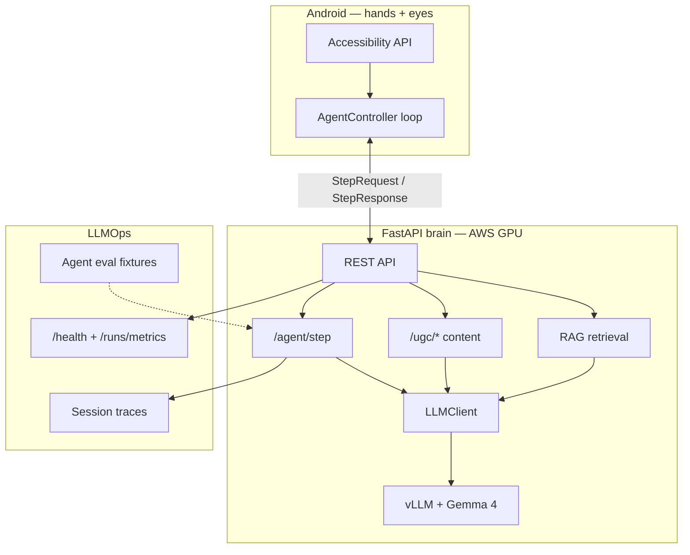

# Friday UGC — Tech Stack & Job-Post Mapping

> How this project maps to common **AI / MLOps / LLMOps / RAG / Agents** job requirements — with honest scope, file paths, and interview talking points.

Friday UGC is a **production-shaped autonomous UGC operator**: a FastAPI **brain** on AWS GPU + a Kotlin **Android agent** that drives Instagram for the Lorena Mor persona (`@itslorenamor`).

---

## Job post → this repo (at a glance)

Typical enterprise AI roles ask for a mix of **data engineering**, **ML lifecycle**, **LLM apps**, and **agent orchestration**. Here is how FridayUGC lines up.

| Job post theme | In FridayUGC? | What we actually use | Where to look |
|----------------|---------------|----------------------|---------------|
| **LLMOps** | Yes | Prompt versioning by file, session traces, eval harness, health checks, retrieval scores | `brain/data/runs/`, `GET /runs/metrics`, `brain/tests/test_agent_eval.py` |
| **MLOps** | Partial | Self-hosted model serving (vLLM), vision pipeline, Docker + CloudFormation deploy, CI | `infra/`, `brain/app/llm/`, `brain/app/gallery/vision.py` |
| **RAG** | Yes | Gallery curation + caption style retrieval over SQLite vector index | `brain/app/retrieval/` |
| **Agents** | Yes | Observe → decide → act loop; multi-phase UGC operator; optional MAF engine | `brain/app/agent/`, `android/.../AgentController.kt` |
| **Microsoft Agent Framework** | Yes (optional) | Alternate `/agent/step` engine via MAF + Ollama or Azure OpenAI | `brain/app/agent/maf_loop.py`, `docs/MAF_SETUP.md` |
| **LangGraph** | Not yet | Custom state machine + server guards instead; natural upgrade for day-plan graph | `brain/app/operator/planner.py`, `brain/app/ugc/operator.py` |
| **LangChain** | Not used | Direct FastAPI + `LLMClient` abstraction — fewer deps, easier to test | `brain/app/llm/`, `brain/app/ugc/director.py` |
| **Spark / Java / Scala** | Not yet | Single-account scale; JSON/SQLite stores today; Spark = future analytics layer | `docs/CASE_STUDY.md` (honest scope) |

**Interview one-liner:** *“I built the full LLM app loop — RAG, agents, LLMOps observability, and GPU serving — without hiding behind framework buzzwords. LangGraph/Spark are the next scale-out steps, not gaps in understanding.”*

---

## Architecture



---

## Stack by layer

### LLM & inference

| Tool | Role | Config / path |
|------|------|----------------|
| **Gemma 4 12B** | Primary reasoning model (agent, UGC director, inbox) | `FRIDAY_GEMMA_*`, `infra/docker-compose.yml` |
| **vLLM** | OpenAI-compatible GPU serving on AWS | `infra/docker-compose.yml` (port 8000) |
| **Gemma 3 12B multimodal** | Gallery vision (vibe, pairing, pillar) | `brain/app/gallery/vision.py` |
| **Ollama** | Local dev + optional MAF / embedding backend | `FRIDAY_OLLAMA_*`, `docs/MAF_SETUP.md` |
| **Mock LLM** | CI and offline tests (no GPU) | `FRIDAY_LLM_PROVIDER=mock` |
| **OmniVoice** | Neural TTS sidecar (Friday assistant voice) | `brain/app/voice/tts.py`, `infra/omnivoice/` |

Custom abstraction — not LangChain:

```text
brain/app/llm/
  base.py      — LLMClient interface
  gemma_vllm.py, ollama.py, mock.py — providers
  health.py    — model readiness for /health
```

---

### RAG (retrieval-augmented generation)

Implemented **without LangChain** — lightweight, testable, Azure-ready.

| Use case | Flow | Endpoint |
|----------|------|----------|
| **Gallery curation** | Embed vision-enriched assets → retrieve top-K before weekly plan | `POST /ugc/curate` |
| **Caption style** | Embed posted captions → few-shot style examples for new captions | `POST /ugc/caption` |

| Component | Technology | Path |
|-----------|------------|------|
| Embeddings | mock / Ollama / OpenAI-compatible / **Azure OpenAI** | `brain/app/retrieval/embeddings.py` |
| Vector store | **SQLite** + cosine similarity | `brain/data/gallery/rag_index.db` |
| Index sync | Hash-based incremental re-embed | `sync_gallery_index`, `sync_caption_index` |
| Observability | `rag_hits`, `rag_scores:*` warnings | `CurateResponse`, `CaptionResponse` |

```bash
POST /gallery/index            # rebuild gallery embeddings
POST /gallery/index-captions   # rebuild caption embeddings from posted queue
GET  /health                   # rag_gallery_indexed, rag_caption_indexed
```

Config: `FRIDAY_RAG_*`, `FRIDAY_EMBEDDING_*` in `brain/.env.example`.

---

### Agents

| Pattern | Description | Location |
|---------|-------------|----------|
| **ReAct-style loop** | Phone sends screen → brain returns **one JSON action** → execute → repeat | `AgentController.kt` ↔ `POST /agent/step` |
| **UGC operator session** | Multi-phase goals: Reels → Stories → Feed → Inbox → Post | `brain/app/ugc/operator.py` |
| **Autonomous scheduler** | SQLite day-plan, WorkManager, foreground service | `brain/app/operator/`, Android `AgentRunner.kt` |
| **Microsoft Agent Framework** | Optional drop-in for `/agent/step` (Ollama or Azure) | `FRIDAY_AGENT_ENGINE=maf` |

Shared contract (phone ↔ brain):

```text
shared/action_protocol.md
brain/app/agent/actions.py
android/.../model/Protocol.kt
```

**LangGraph analogy:** Friday already has phases, budgets, and guards — LangGraph would formalize that as an explicit graph (conditional edges on quota, stuck-screen recovery). The domain logic exists; the orchestration library does not.

---

### LLMOps & MLOps practices

| Practice | FridayUGC implementation |
|----------|-------------------------|
| **Tracing** | Every agent step → `brain/data/runs/{session_id}.json` |
| **Metrics API** | `GET /runs/metrics` — latency, guard rate, completion |
| **Eval harness** | Frozen IG screen scenarios, mock LLM regression tests | `brain/tests/fixtures/agent_scenarios/` |
| **RAG eval** | Retrieval ranking + score logging tests | `brain/tests/test_retrieval.py` |
| **Safety layer** | Server-side guards, approval gates, word sanitization | `brain/app/agent/prompt.py`, `brain/app/ugc/safety.py` |
| **CI** | Brain pytest + Android APK build | `.github/workflows/` |
| **IaC deploy** | CloudFormation GPU EC2 + Docker Compose | `infra/cloudformation/`, `infra/deploy.sh` |
| **Config management** | Pydantic Settings + `.env` | `brain/app/config.py` |

What we **don’t** have (and say so in interviews):

- MLflow / Kubeflow model registry
- Prompt registry SaaS (prompts live in repo as versioned files)
- Spark data lake (single-account scale; traces are JSON files)

---

### Mobile & integration

| Tool | Role |
|------|------|
| **Kotlin** | Android agent app |
| **Accessibility Service** | Read UI tree, inject taps/scrolls/type |
| **OkHttp + kotlinx.serialization** | Brain API client |
| **WorkManager + Foreground Service** | Scheduled autonomous runs |
| **Material 3** | Operator UI |

---

### Data stores

| Store | Backend | Used for |
|-------|---------|----------|
| Gallery manifest | S3 JSON or local file | Media inventory |
| RAG index | SQLite | Gallery + caption embeddings |
| Gallery queue | SQLite | Scheduled posts, posted captions for RAG |
| Operator state | SQLite | Autonomous day-plan |
| Inbox ledger | JSON | DM/comment reply caps |
| Session traces | JSON files | LLMOps / debugging |

**Spark / Java / Scala:** Relevant when you operate **many accounts** or batch-process **analytics exports + vision at scale**. At current scale, FastAPI + SQLite + S3 is the right tradeoff.

---

## Job-post deep dive

### “LLMOps / MLOps”

**What employers mean:** Ship models and LLM features reliably — deploy, monitor, evaluate, iterate.

**What Friday proves:**

1. **Deploy** — GPU brain on AWS with vLLM + Docker (`infra/`)
2. **Monitor** — per-step traces and aggregate metrics (`GET /runs/metrics`)
3. **Evaluate** — agent scenario suite + RAG retrieval tests
4. **Iterate** — persona prompts, RAG corpus grows from posted content, embedding provider swappable via env

**Demo commands:**

```bash
curl -s localhost:8080/health | jq '{provider, rag_enabled, embedding_provider, rag_gallery_indexed, rag_caption_indexed}'
curl -s -H "Authorization: Bearer $FRIDAY_API_TOKEN" localhost:8080/runs/metrics | jq .
cd brain && FRIDAY_LLM_PROVIDER=mock FRIDAY_API_TOKEN=test-token pytest tests/test_agent_eval.py tests/test_retrieval.py -q
```

---

### “RAG”

**What employers mean:** Retrieve relevant context before generation — docs, history, metadata.

**What Friday proves:**

- **Indexed documents:** vision summaries, vibes, pillars, pairing hints (gallery); posted captions (voice)
- **Retrieval strategy:** semantic search + pillar diversity backfill (gallery)
- **Production concerns:** incremental index, fallbacks, score logging for A/B eval

**Demo:** Curate with director notes and inspect `rag_hits` in the response:

```bash
curl -s -X POST -H "Authorization: Bearer $FRIDAY_API_TOKEN" -H "Content-Type: application/json" \
  -d '{"days_ahead":7,"notes":"Heavy gym week — leg day focus","refresh_vision":false}' \
  localhost:8080/ugc/curate | jq '{warnings, rag_hits}'
```

---

### “Agents — LangGraph, Microsoft Agent Framework”

**What employers mean:** Multi-step AI that plans, uses tools, and loops until done.

**What Friday proves:**

- **Real agent loop** on a real UI (Instagram via Accessibility) — harder than calling APIs in a notebook
- **Tool-like actions:** tap, scroll, navigate, post (JSON protocol)
- **Microsoft Agent Framework:** integrated as optional engine — same phone contract, swap `FRIDAY_AGENT_ENGINE=maf`

**Why not LangGraph yet:** The default path is a **testable Python loop** with server-side guards. LangGraph adds value when session graphs get complex (recovery branches, human-in-the-loop nodes) — see `brain/app/operator/planner.py`.

**MAF setup:** `docs/MAF_SETUP.md`

---

### “LangChain”

**What employers mean:** Compose LLM chains, tools, retrievers.

**Friday’s choice:** **Direct composition** in FastAPI handlers + small `retrieval/` module.

| LangChain concept | Friday equivalent |
|-------------------|-------------------|
| Chat model | `LLMClient.chat()` |
| Retriever | `retrieve_assets_for_curation`, `retrieve_caption_examples` |
| Chain | `director.make_caption`, `curator.curate`, `agent.router.decide` |
| Memory | Step history in `StepRequest`; MAF session when enabled |

You understand the **patterns**; you chose **less framework surface** for debuggability and CI.

---

### “Spark / Java / Scala”

**What employers mean:** Big data pipelines, feature stores, batch analytics.

**Friday today:** Not in scope — one persona, SQLite/JSON, synchronous vision per asset.

**Credible “next step” story:**

```text
IG analytics export → Spark batch → “which pillars convert” features
→ feed gallery RAG curation query or curator prompt
Session traces at scale → Spark agg on guard rates / step failures
```

That’s architecture you can whiteboard without claiming it’s built.

---

## Environment cheat sheet

| Variable | Purpose |
|----------|---------|
| `FRIDAY_LLM_PROVIDER` | `mock` \| `ollama` \| `gemma_vllm` |
| `FRIDAY_AGENT_ENGINE` | `legacy` \| `maf` |
| `FRIDAY_RAG_ENABLED` | Toggle RAG |
| `FRIDAY_EMBEDDING_PROVIDER` | `mock` \| `ollama` \| `azure` |
| `FRIDAY_VISION_ENABLED` | Gallery multimodal analysis |

Full list: `brain/.env.example`

**Production embeddings (AWS):**

```bash
EMBEDDING_PROVIDER=ollama EMBEDDING_BASE_URL=http://host.docker.internal:11434/v1 docker compose up -d
```

**Azure embeddings:**

```bash
FRIDAY_EMBEDDING_PROVIDER=azure
FRIDAY_EMBEDDING_AZURE_ENDPOINT=https://YOUR_RESOURCE.openai.azure.com
FRIDAY_EMBEDDING_AZURE_DEPLOYMENT=text-embedding-3-small
```

---

## Related docs

| Doc | Contents |
|-----|----------|
| [ARCHITECTURE.md](./ARCHITECTURE.md) | System design, request lifecycle |
| [CASE_STUDY.md](./CASE_STUDY.md) | Portfolio narrative + metrics template |
| [MAF_SETUP.md](./MAF_SETUP.md) | Microsoft Agent Framework |
| [SAFETY_AND_BANS.md](./SAFETY_AND_BANS.md) | Approval gates, ban risk |
| [SETUP_GUIDE.md](./SETUP_GUIDE.md) | End-to-end install |

---

## Summary for recruiters

Friday UGC is a **full-stack LLM product demo**, not a tutorial repo:

- **Agents** — production phone executor + cloud brain, JSON action protocol, safety guards  
- **RAG** — gallery + caption retrieval with eval tests and score observability  
- **LLMOps** — traces, metrics API, regression fixtures, health checks  
- **MLOps** — GPU serving, Docker, CloudFormation, vision pipeline, CI  
- **Microsoft Agent Framework** — optional, documented, swappable engine  
- **Honest gaps** — LangChain/LangGraph/Spark not bolted on for buzzword coverage; mapped to concrete next steps  

Built to answer: *“Can this person ship AI systems, not just call APIs?”*
